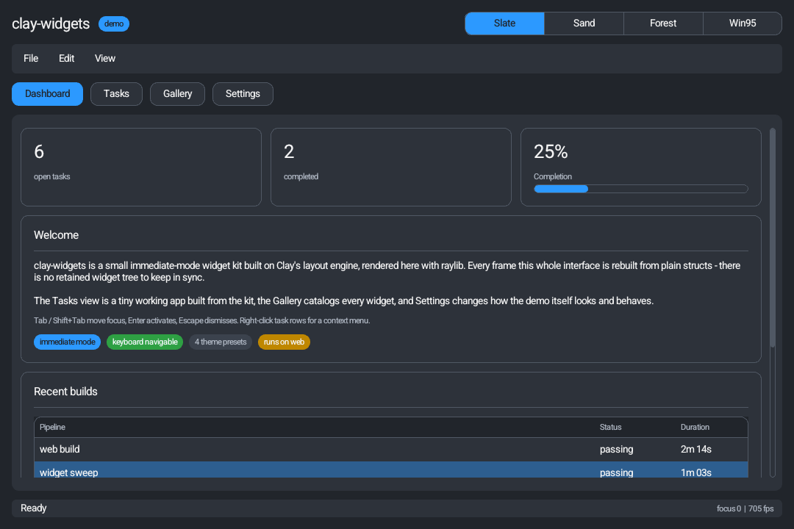
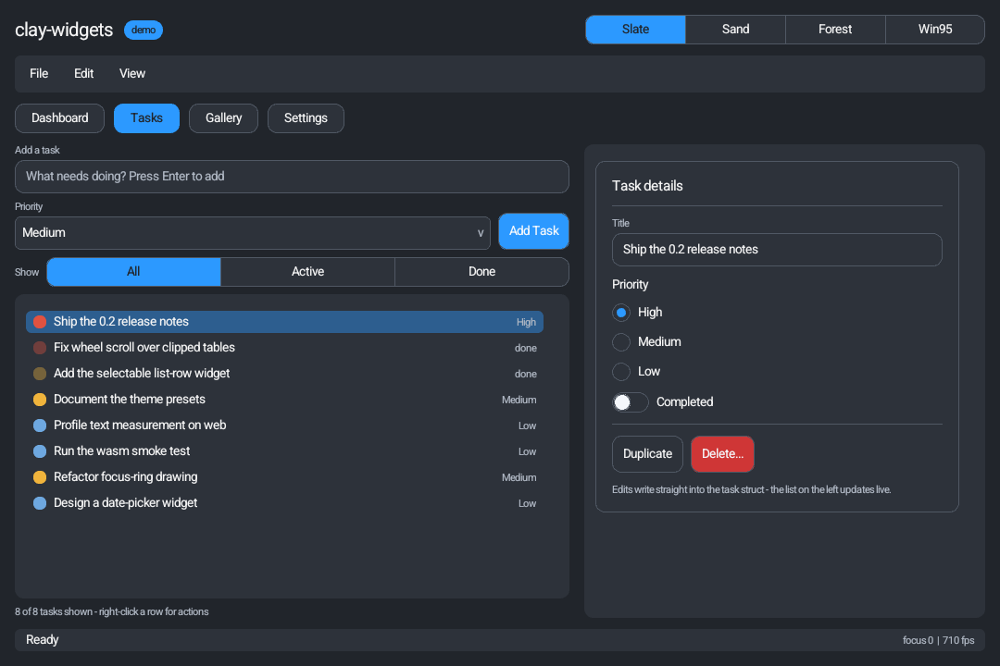
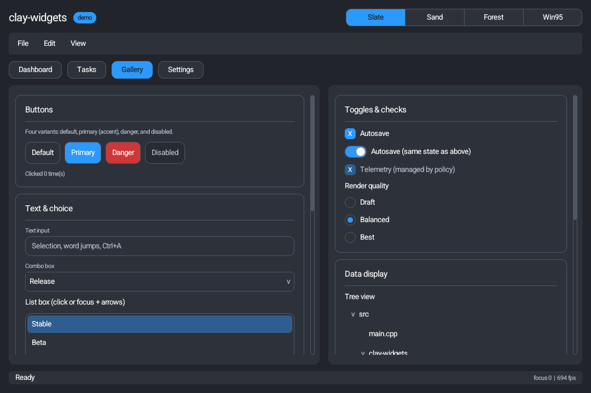
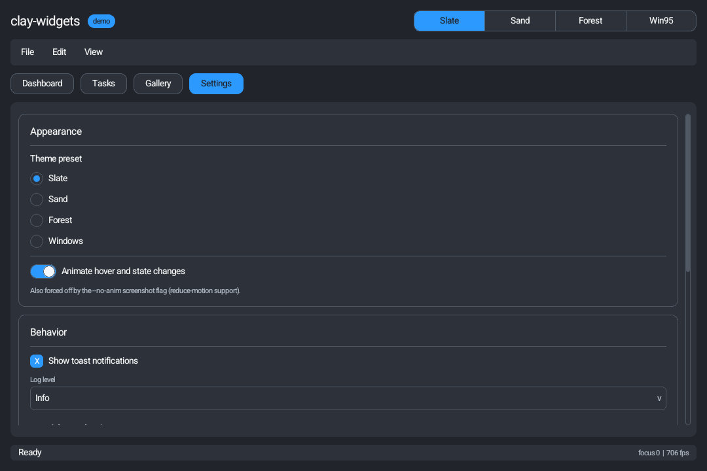

# clay-widgets

Widget layer built on top of Clay with a raylib demo application.



## Project layout

The tree separates three things: the renderer-agnostic **widget library**, the
**raylib backend** that draws it, and the **demo app** built on top.

- `clay-widgets/`: the widget library - `widgets.h` is the umbrella header over a
  structured tree with shared core helpers (`core.h`), theme presets (`themes.h`)
  and one header per widget. Knows nothing about raylib or the demo.
- `backends/raylib/`: the raylib backend.
  - `clay-raylib-renderer.h`: turns a `Clay_RenderCommandArray` into raylib draw
    calls, plus the font-atlas cache, text-measurement callback and web frame glue.
  - `text-gamma.h`: optional gamma-correct font-atlas baking.
- `demo/`: the demo application, one file per concern.
  - `main.cpp`: the entry point - window/font setup, the frame loop, and the
    `#include`s that assemble the demo into one translation unit.
  - `demo-state.h`: the `DemoState` data model and shared helpers.
  - `chrome.h`: header, menu bar, navigation and status bar.
  - `screens/`: one file per view (`dashboard.h`, `tasks.h`, `gallery.h`, `settings.h`).
  - `floating-layers.h`: context menus and the delete-confirmation modal.
- `tests/`: headless unit tests for the widget library (`test-widgets.cpp`) -
  real frames driven with synthetic input and a fake text measurer, no raylib
  or window needed. Run with `make test`; CI runs them on every push.
- `tools/`: all scripts - build (`build.py`, `build_web.py`), codegen
  (`embed_font.py`, `amalgamate.py`) and docs (`screenshot_panels.py`).
- `assets/`: source fonts (`fonts/`, see the license note there) and generated
  code (`generated/embedded-font.h`, produced by `tools/embed_font.py`; bakes the
  UI font into the binary - see "Self-contained binary" below. Committed so the
  project builds with just a C++ compiler).
- `web/`: web-build inputs (`shell.html`, the emscripten page the wasm build is
  embedded into). The web *output* goes to `build/web/`.
- `docs/`: screenshots used by this README.
- `Makefile`: builds raylib from source in `subprojects/raylib` and then builds the demo.
- `subprojects/raylib`: raylib source (git submodule).
- `subprojects/clay`: Clay source (git submodule, used for `clay.h`).

## Widgets currently demonstrated

- Label
- Heading
- Separator
- Image / Icon (tintable textures)
- Button
- Checkbox
- Toggle / switch
- Radio buttons
- Tabs (pill and attached styles)
- Slider
- Progress bar
- Text input
- Combo box (dropdown select)
- List box (selectable, keyboard-navigable list)
- Selectable list row (color swatch + label + trailing text)
- Segmented control (joined single-select buttons)
- Stepper / number input (+/- with min/max/step)
- Badge / chip / tag (status pills)
- Menu bar with drop-down menus
- Right-click context menu
- Tooltip (hover, delayed)
- Toast / notification (transient, auto-dismissing, stacks up to a small queue)
- Modal dialog (dimming scrim)
- Card / group box (titled bordered container)
- Collapsible / accordion section
- Tree view (hierarchical expand/collapse)
- Table / data grid (columns, header, zebra rows, selection)
- Scroll panel with draggable scroll bar

## Interaction behavior

- Pointer interaction for all controls.
- Keyboard focus traversal with `Tab` (forward) and `Shift+Tab` (backward)
  across interactive widgets.
- Keyboard activation with `Enter` for buttons, checkboxes, and radio buttons.
- Focused sliders adjust with `Left`/`Right` (stepping by `step`, or 1% of the
  range) and jump with `Home`/`End`; steppers step with the arrow keys.
- Focused text input supports typing, selection, `Backspace`/`Delete`,
  `Ctrl+A`, clipboard `Ctrl+C`/`Ctrl+X`/`Ctrl+V` (via platform callbacks
  injected with `ClayWidgets_SetClipboardFunctions`), and `Escape` to blur.
  Held editing/navigation keys repeat.
- Combo dropdowns cap their height and scroll long item lists, open upward
  when there is no room below the trigger, and keep the keyboard highlight
  scrolled into view.
- Open modals trap keyboard focus: `Tab` cycles the dialog's own controls and
  `Enter` cannot activate anything behind the scrim.
- Widgets accepting an options struct (button, slider, stepper, text input)
  plus checkbox and toggle support a `disabled` state: inert, muted, skipped
  by focus traversal.

## Animations

Widgets animate their state changes using Clay's built-in transition engine
(`Clay_EaseOut`), so no extra per-frame bookkeeping is needed - a widget just
declares a `.transition` on its element and keeps setting its target color as
usual. Two kinds are used:

- **Color transitions** - hover / selected / pressed background colors ease in
  over a short curve instead of snapping. Wired into buttons, list/table/tree
  rows, tabs, segmented cells, menu items and combo triggers/items, and the
  toggle track. (Checkbox/radio boxes keep a constant fill, so they are not
  animated here.)
- **Enter transition** - the modal scrim's dimming overlay fades in when a modal
  opens, while the dialog stays crisp and remains clickable during the fade.

Some effects aren't a property of a single element and so can't be a Clay
transition - the toggle knob *sliding* across its track is the canonical case.
For these the library keeps a small per-widget eased scalar keyed by element id
(`ClayWidgets__AnimTo`), advanced each frame with frame-rate-independent
exponential smoothing. The toggle drives that 0..1 value into its knob position;
`animationsEnabled` and reduce-motion apply here too (the value snaps to its
target). This is the pattern to reuse for future motion like an accordion's
height or a tab underline.

Notes and knobs:

- `ctx->animationsEnabled` (default `true`) globally turns transitions off, which
  makes them snap instantly. Set it to `false` to honor a reduce-motion
  preference or to get deterministic frames for screenshot testing.
- Durations are compile-time tunables: `CLAY_WIDGETS_ANIM_HOVER_DURATION`
  (default `0.12f`) and `CLAY_WIDGETS_ANIM_ENTER_DURATION` (default `0.18f`).
- Clay transitions apply to the element they are set on and do **not** cascade to
  child elements, so fade-ins are only used on solid overlays (the scrim) whose
  visual is their own fill - not on panels that host crisp child text. Dropdown
  and toast enter/exit animations would need per-widget opacity handling instead.

## Demo coverage

The demo is organized like a small application, with four views:

- **Dashboard** (0): live task statistics in stat cards, a completion progress
  bar, a selectable data table, and quick-action buttons in all variants
  (default, primary, danger, disabled).
- **Tasks** (1): a working to-do manager - add tasks with Enter or a primary
  button, filter with a segmented control, select rows (the list-row widget
  with priority swatches and trailing text), edit the selected task in place,
  and delete via a confirming modal or right-click context menu.
- **Gallery** (2): the full widget catalog grouped into cards - buttons, text
  and choice inputs, ranges, attached tabs, toggles/checks, tree, icons,
  badges, and overlay demos (toasts, modal, context menu, tooltips).
- **Settings** (3): theme preset switching (Slate, Sand, Forest, Windows), an
  animations toggle, a notifications toggle that gates the demo's toasts, and
  a live diagnostics card (focused widget id, pointer, fps).

| Dashboard | Tasks |
| --- | --- |
|  |  |

| Gallery | Settings |
| --- | --- |
|  |  |

The screenshots are regenerated with `python tools/screenshot_panels.py`.

## Self-contained binary

The desktop build is a single portable `.exe` with no external dependencies:

- **No asset files.** The UI font is baked into the binary. `tools/embed_font.py`
  converts `assets/fonts/Roboto-Regular.ttf` into `assets/generated/embedded-font.h`
  (a byte array), which the raylib backend hands to raylib's `LoadFontFromMemory`. The
  demo icons are already generated procedurally at startup, so nothing is read
  from disk at runtime - the exe runs from any directory with `assets/` absent.
  Re-run `python tools/embed_font.py` (or `make font`) only if the source font changes.
- **No redistributable DLLs.** raylib is linked as a static `.a`, and the
  Makefile passes `-static -static-libgcc -static-libstdc++` so the GCC/C++
  runtime is linked in too. The only remaining imports are always-present
  Windows system DLLs (`kernel32`, `user32`, `gdi32`, `opengl32`, `winmm`, ...).
- The **web build** is likewise self-contained: because the font is embedded,
  `tools/build_web.py` drops `--preload-file`, so there is no separate `index.data`.

## MSYS2 setup (recommended)

Open the `MSYS2 MinGW 64-bit` shell and install toolchain dependencies:

```bash
pacman -Syu
pacman -S --needed mingw-w64-x86_64-toolchain make git
```

## Build

Clay and raylib are git submodules, so clone with them included:

```bash
git clone --recurse-submodules <repo-url>
# or, in an existing checkout:
git submodule update --init
```

From the project root:

```bash
python tools/build.py
```

or directly with make:

```bash
mingw32-make
```

This does two things:

1. Builds raylib static library from `subprojects/raylib/src`.
2. Builds `clay-widgets-demo.exe`.

## Run

```bash
mingw32-make run
```

or launch `./clay-widgets-demo.exe` directly.

## Web build (WebAssembly + canvas)

The same raylib app can be compiled to WebAssembly and run in a browser on an
HTML `<canvas>`, so the web page looks identical to the desktop demo. This uses
[Emscripten](https://emscripten.org/); `build_web.py` installs it for you.

From the project root:

```bash
python tools/build_web.py           # installs emsdk (first run, ~1GB) + builds
python tools/build_web.py --serve   # build, then serve at http://localhost:8000
```

This produces `build/web/index.html` (plus `index.js`, `index.wasm`). The output
must be served over HTTP - browsers won't `fetch` the `.wasm` from a `file://`
URL. Use `--serve`, or point any static server at `build/web/`.

Other flags:

- `--clean` removes `build/web/` and the web raylib lib before building.
- `--skip-raylib` reuses an existing `libraylib.web.a` (skips the raylib rebuild).
- `--emsdk-version X` pins a specific Emscripten SDK version (default `latest`).

Notes:

- The web build is entirely separate from the desktop one: raylib for web is
  archived as `libraylib.web.a`, so it never clashes with the desktop
  `libraylib.a`. The Emscripten SDK lands in `subprojects/emsdk/` (git-ignored).
- `demo/main.cpp` shares one code path for both targets; on web (`__EMSCRIPTEN__`)
  the frame loop is driven by `emscripten_set_main_loop` instead of a native
  `while (!WindowShouldClose())` loop. The desktop build is unchanged.
- The screenshot harness flags are desktop-only.

## Clean

```bash
python tools/build.py --clean
```

or directly with make:

```bash
mingw32-make clean
mingw32-make raylib-clean
```

## Tests

The widget library has a headless unit-test suite: Clay computes layout
without a GPU, so the tests drive real frames (focus traversal, the modal
focus trap, text editing and clipboard, combo keyboard/flip/scroll, panel
scrolling, the toast queue, overflow reporting) with synthetic input and
assert on state and render commands.

```bash
make test    # builds build/test-widgets.exe and runs it
```

CI runs the suite before the demo build on every push.

## Single-header amalgam

For dropping the library into another project, `tools/amalgamate.py`
generates a single `clay-widgets.h` (the whole `clay-widgets/` tree inlined
in include order, stb-style). It is generated, never committed - the split
headers stay the single source of truth.

```bash
make amalgam        # writes build/clay-widgets.h
make test-amalgam   # compiles + runs the full unit-test suite against it
```

Usage in a consuming project is identical to the split tree: put
`clay-widgets.h` next to (or on the include path with) `clay.h` - which is
deliberately not bundled - and define `CLAY_WIDGETS_IMPLEMENTATION` in exactly
one translation unit before including it. CI regenerates the file, runs the
whole test suite against it, and uploads it as the
`clay-widgets-single-header` artifact on every push.

## Notes

- `clay-widgets/widgets.h` includes `clay.h` and the sibling split headers, so the Makefile adds `subprojects/clay` to include paths.
- Text input expects UTF-8 bytes from the platform layer. `demo/main.cpp` converts raylib codepoints to UTF-8 bytes each frame.
- Clipboard support is injected: pass your platform's get/set functions to
  `ClayWidgets_SetClipboardFunctions` (the demo wires raylib's). Without them,
  the clipboard keys are ignored.
- Exceeding a compile-time cap at runtime (scratch strings for stepper/slider
  values, focus order, table columns) is reported through the handler set with
  `ClayWidgets_SetErrorHandler`; with no handler, a debug build prints and
  aborts (`CLAY_WIDGETS_ASSERT`), and a release build stays silent. The caps
  are tunable defines (`CLAY_WIDGETS_TEXT_SCRATCH_COUNT`,
  `CLAY_WIDGETS_MAX_FOCUSABLES`, `CLAY_WIDGETS_MAX_TOASTS`, ...).
- Keep widget IDs stable across frames for consistent interaction behavior.
- Image tint transport: this Clay build emits a stray RECTANGLE whenever an
  element's `backgroundColor` alpha is non-zero, so `image.h` sends the icon
  tint through the element's `userData` as a packed `0xRRGGBBAA` instead. The
  raylib renderer decodes it with `ClayWidgets_UnpackTint`.

## Screenshot harness

`demo/main.cpp` accepts flags to render a few frames headless, inject synthetic
input, capture a PNG (via raylib `TakeScreenshot`, written relative to the
working directory) and exit. This is used to verify widgets without a human at
the keyboard:

```
clay-widgets-demo --shot out.png [--view N] [--frames N] [--theme N]
                  [--mouse X Y] [--mousedown] [--rightclick] [--scroll DY]
                  [--mouse2 X Y] [--mousedown2] [--openmodal] [--toast] [--no-anim]
```

- `--view` selects Dashboard (0), Tasks (1), Gallery (2) or Settings (3).
- `--no-anim` turns off all widget transitions so a single frame is the settled
  state. Because animations are time-based, without this a low `--frames` count
  captures a mid-transition frame; either pass `--no-anim`, or raise `--frames`
  (e.g. 20+) to let the animation settle.
- `--theme` picks a preset (1 Slate, 2 Sand, 3 Forest, 4 Windows).
- `--mouse`/`--mousedown` inject a pointer and a scripted click (`--rightclick`
  makes that a right-click, e.g. to open a context menu); `--mouse2`/
  `--mousedown2` add a second interaction phase (e.g. open a menu, then choose
  an item).

`tools/screenshot_panels.py` drives this harness once per view to regenerate
the README screenshots in `docs/screenshots/` in one command.

## License

MIT - see [LICENSE](LICENSE). The bundled fonts keep their own licenses; see
[assets/fonts/README.md](assets/fonts/README.md). Clay and raylib (git
submodules under `subprojects/`) are zlib-licensed by their respective authors.
